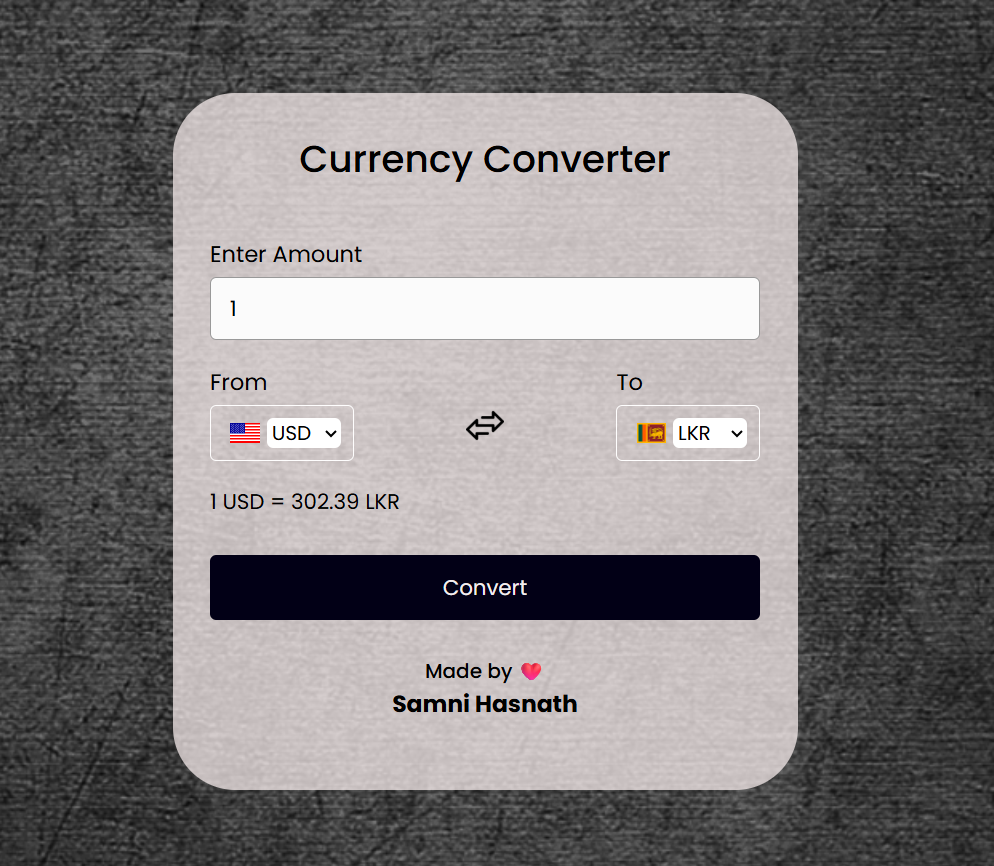

# Currency-Converter

<h1 align="center"> Currency Converter App </h1>

A simple Currency Converter app that allows users to convert one currency into another using real-time exchange rates. The application uses a free API to fetch live exchange rates and perform the currency conversion. It features a clean and intuitive user interface.

## 🌐 Live Demo

## 📸 Project Preview
Here's a sneak peek of the Currency Converter App:

## 🚀 Features
- Allows users to convert between various currencies using live exchange rates.
- Provides a dropdown for selecting different currencies.
- Instant conversion with updated exchange rates.
- Simple and responsive design that works on both desktop and mobile devices.
- Displays both the conversion result and the amount entered.

## 🛠️ Tech Stack
- **HTML** : For the structure of the currency converter form.
- **CSS** : For styling the page and making it visually appealing.
- **JavaScript** : For fetching live exchange rates via API, handling user inputs, and performing the conversion.

## 👨‍💻 Created by
This project was created and is maintained by:
**SAMNI HASNATH**

Feel free to reach out if you have any questions or suggestions! ❤️

